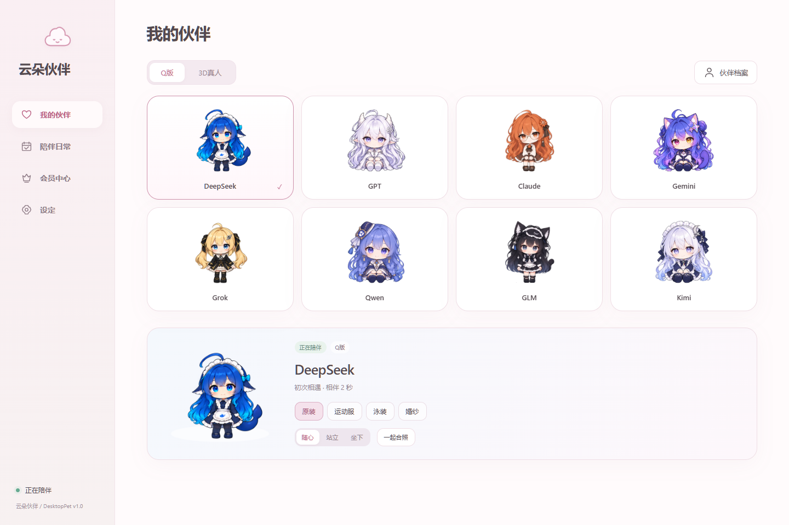
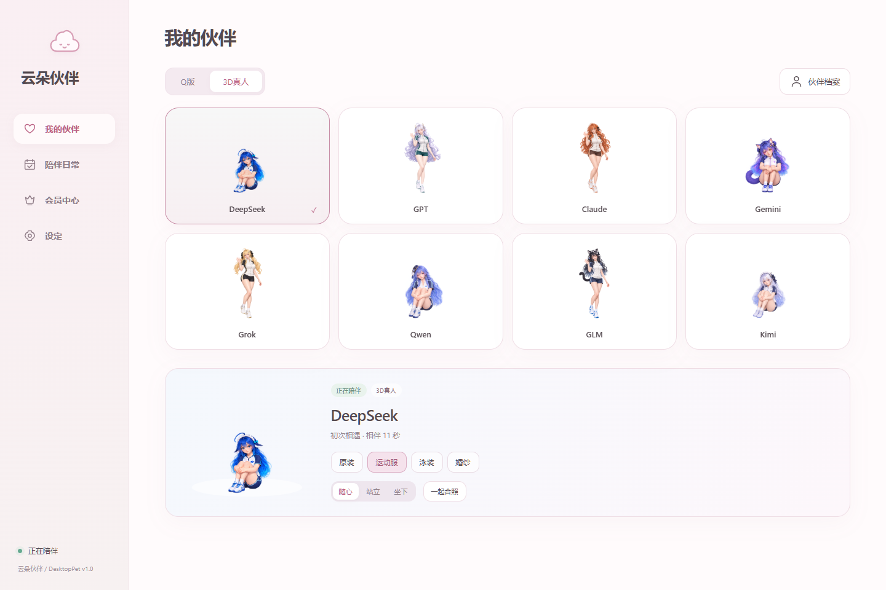
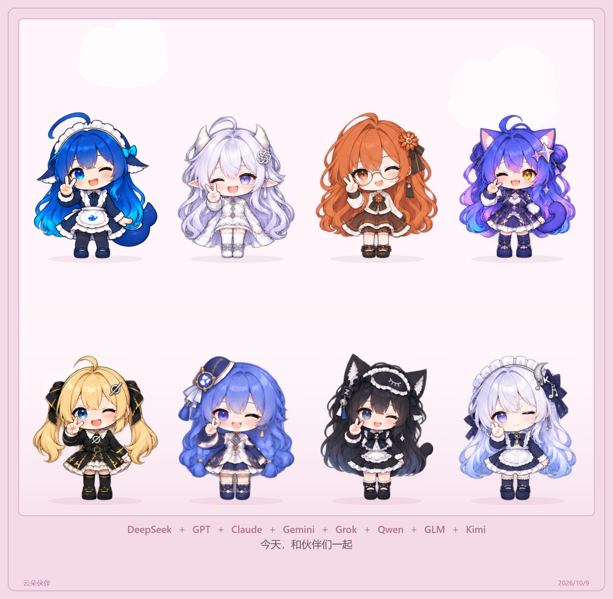
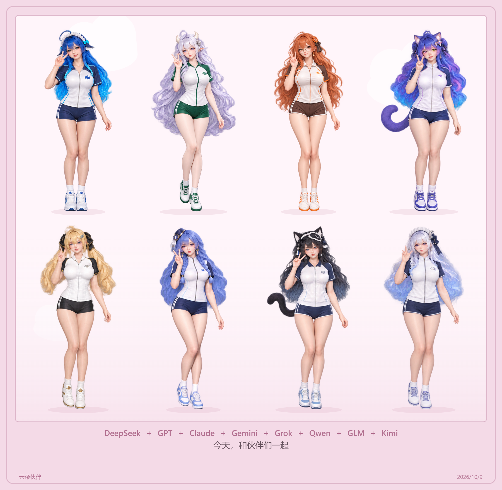
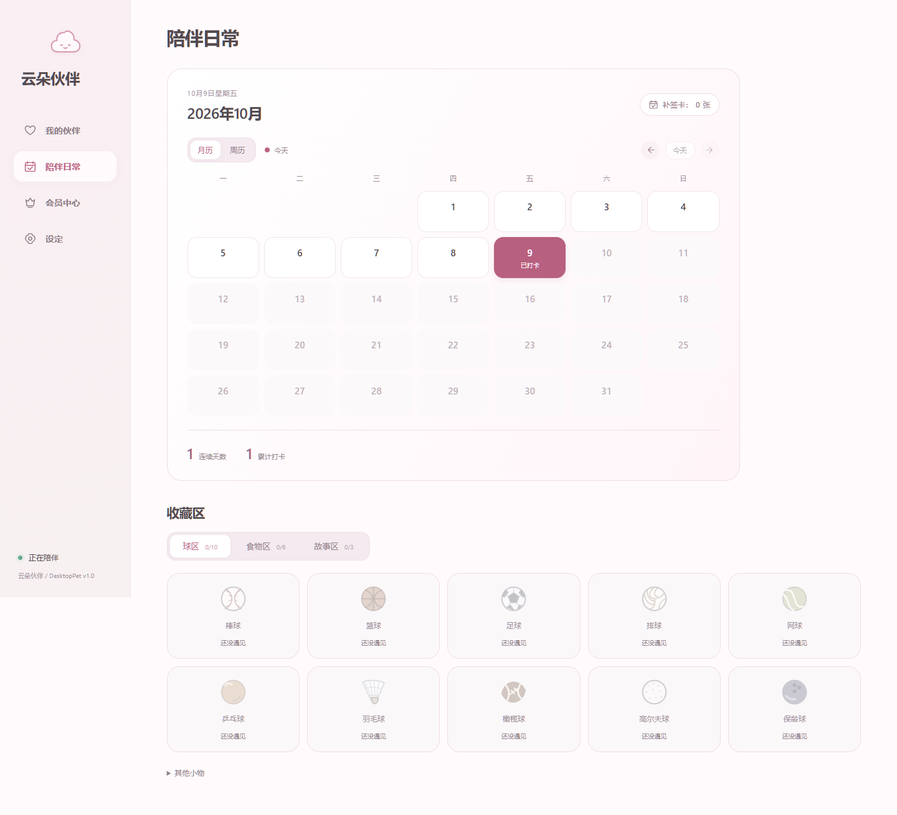

# 云朵伙伴 · DesktopPet

**v1.0 · 重要版本**　|　Windows x64　|　8 位伙伴 · 2 种风格 · 4 套服装

当前源码与待审 HTML Demo 为 **v1.1**：新增[宠物行事历方案](docs/pet-agenda-plan.md)，在聊天中通过 AI 整理事件、确认后记入日历，再由宠物到点提醒。未接入原生；v1.0 重要版本标签及下方展示图保留。

住在桌边的云朵伙伴。摸摸头、玩玩球、一起读故事，也可以安静陪你工作。暖粉云朵界面，透明圆盘菜单，基础陪伴无需登录。

[重要版本说明](docs/releases/v1.0.md) · [v1.0 Release](https://github.com/q438241zy/DesktopPet_AI/releases/tag/v1.0) · [Demo 使用说明](docs/demo/companion-v01/README.md) · [个人非商业许可](LICENSE)

> v1.0 将当前源码与 HTML Demo 标记为重要里程碑。最新的站坐选择、2–8 人合照可在 Demo 中体验；本轮没有把这两项新设计接入原生程序，已部署桌面程序仍为 v0.5，也没有重打正式安装包。

## 我的伙伴

DeepSeek、GPT、Claude、Gemini、Grok、Qwen、GLM、Kimi。每位伙伴都有 Q版和3D真人两种风格，原装、短袖短裤运动服、泳装、婚纱四套服装，共 64 套外观。衣橱分别记住各角色和画风的选择。



<details>
<summary>查看 3D真人运动服面板</summary>



</details>

## 一起合照

勾选 2–8 位伙伴，保留各自服装，输入照片上的话，选择暖云、浅玉或奶油相框。人数多时分成两排，以统一比例保留发丝、裙摆和尾巴。支持保存 PNG；桌面保存选择器不可用时，浏览器会使用下载并提示。

| Q版合照 Demo | 3D真人合照 Demo |
| --- | --- |
|  |  |

## 陪伴与互动

| 功能 | 内容 | 当前范围 |
| --- | --- | --- |
| 桌面陪伴 | 散步、提起、摇晃头晕、边缘躲藏、透明圆盘菜单 | 原生程序 |
| 照顾与玩耍 | 喂食、摸头、揉脸、梳头、擦脸、玩球、搭积木、数星星、吹泡泡等 | 原生程序 |
| 双向互动 | 击掌、猜拳、随机礼物、翻书共读，礼物与读完的故事可收藏 | 原生程序 |
| 角色聊天 | 八位角色各自的性格和喜好；本机预设对话或用户自己的 API；回复前至少思考一秒 | 原生程序与 Demo |
| 伙伴档案 | 好感度 −100 至 +100、陪伴时间；按角色独立记录，两种风格共用关系 | 原生程序与 Demo |
| 陪伴日常 | 月历/周历、点日期打卡、补签卡、球类/食物/故事收藏 | 原生程序与 Demo |
| 工作模式 | 开关启用，1–180 分钟循环提醒；无需自行填写提醒内容 | 原生程序与 Demo |
| 站坐待机 | 随心 / 站立 / 坐下，随心约每 12–18 秒切换，记住角色偏好 | 本次 HTML Demo |
| 多人合照 | 2–8 位角色、文字、三款相框、PNG 导出 | 本次 HTML Demo |

3D真人使用成年比例的二维图集与程序动画，并非实时三维模型。站坐 Demo 沿用现有图稿，部分 Q版服装为侧面站姿；静态切换不代表新增了连续起身动画。

<details>
<summary>查看日历打卡与收藏区</summary>



</details>

以上展示图均由独立的空白测试浏览器生成，只包含 Demo 页面及合照画布；未拍摄使用者桌面、任务栏或其他窗口。图中的陪伴与打卡为演示记录，不使用个人账号、聊天记录或 API Key。

## 开始使用

本次 [v1.0 Release](https://github.com/q438241zy/DesktopPet_AI/releases/tag/v1.0) 提供源码里程碑与更新说明，不附新的正式安装包。历史文件见 [Releases](https://github.com/q438241zy/DesktopPet_AI/releases)，历史包不代表本轮 Demo 已接入。正式安装包目前采用解压即用 ZIP：保留整个目录及 `Assets`，双击 `DesktopPet.exe`，无需另装 .NET。

- 左键点击或拖动角色：互动、提起；普通松手停在当前位置，按住 Shift 松手才下落。
- 右键角色：展开透明圆盘菜单，打开菜单不会取消当前动作。
- 躲藏后等待左键找到；可在设定关闭闲置一分钟躲藏。
- 工作模式、模型服务与减少动态效果位于「设定」。

| 快捷键 | 操作 |
| --- | --- |
| Ctrl+Alt+U | 显示 / 隐藏宠物 |
| Ctrl+Alt+S | 打开云朵伙伴 |
| Ctrl+Alt+L | 解除鼠标穿透并找回宠物 |
| Esc | 结束当前手势或关闭菜单 |

## 本机对话与模型接口

未设置接口时使用各角色的本机预设多轮对话。可配置 GPT/OpenAI、Claude、Gemini、Grok、DeepSeek、Qwen、GLM、Kimi；Claude 使用 Messages，Gemini 使用 generateContent，其余使用各家 Chat Completions 协议。接口格式与核对范围见 [八家接口说明](docs/companion-api-providers.md)。模拟验证不等于真实账号连通测试，模型名称需填写账号实际可用的型号。

API Key 只保留在本次会话。只有配置服务并使用相关功能时，聊天内容才会发送至指定接口。测试期间聊天和适用风格开放；会员注册仍为本机账号，尚未提供云端会员服务。

## 本地数据与隐私

原生存档位于 `%LOCALAPPDATA%/DesktopPetAI/`。Demo 使用独立浏览器存档，不与日常宠物合并；开发验证使用独立目录。程序不读取旧看板 Cookie、账号令牌或 Codex 凭据。

对外展示仅使用隔离的演示数据。公开截图通过 [展示生成脚本](tools/capture-readme-showcase.cjs) 重现，不读取个人浏览器配置，不捕获桌面；生成图片检查不携带 EXIF 或文本元数据。

## 开发与验证

原生程序需要 Windows x64 和 .NET 10 SDK。

```powershell
dotnet run --project src/DesktopPet.App
dotnet run --project tests/DesktopPet.Tests -c Release
./tools/check.ps1
./tools/publish.ps1
```

HTML Demo 从原始图稿生成，需 Python、Pillow、NumPy、OpenCV；浏览器自动检查使用 Node.js、Playwright 和 Chrome。代码与图稿保留在项目目录，不需要放在桌面。

```powershell
./tools/install-companion-demo.ps1
Start-Process ./Release/win-x64/Demo/CompanionV01/index.html
```

原生 `publish.ps1` 生成运行目录，正式安装包仅在需要时使用 `tools/package.ps1 -RuntimeOnly` 制作，不把用户存档或大型 Demo 带入包中。

- [v1.0 重要版本说明](docs/releases/v1.0.md)：版本基线、展示来源与本次范围。
- [站坐与多人合照验证](docs/verification-v06-demo.md)：64 套外观、56 种合照布局、PNG 导出与手机布局。
- [运动服完整验证](docs/verification-v05.md)：八位角色、两种风格的原图换衣与配套动作。
- [原生伙伴功能验证](docs/verification-v04.md)：月/周历、人物档案、关系、接口与工作模式。
- [Windows 输入验证](docs/verification-preview28.md)：行走点击、提起与系统鼠标输入。

版本唯一来源为 [Version.props](Version.props)。本次由使用者指定升为 **v1.0 重要版本**；后续普通更新为 v1.1、v1.2，大版本仍由使用者决定。旧体系的 `v1.0.0` 标签保留历史含义，不覆盖改写。详见 [版本管理](docs/versioning.md)。

## 来源与许可

由 **QQ奶茶大神** 的 UsageDashboard_AI 与 Character_Generator 整合而来，互动和八位 AI 角色的 Q版画稿来自 DS Go。沿用 Windows 原生 WPF 透明窗口；取消举看板和余额采集，角色工房及舞蹈已移除。

沿用 [个人非商业许可](LICENSE)，保留作者署名；DS Go 移植部分、依赖与美术来源见 [第三方说明](THIRD_PARTY_NOTICES.md)。角色同人形象不代表对应厂商的官方吉祥物，第三方角色与商标的权利归原权利方所有。
