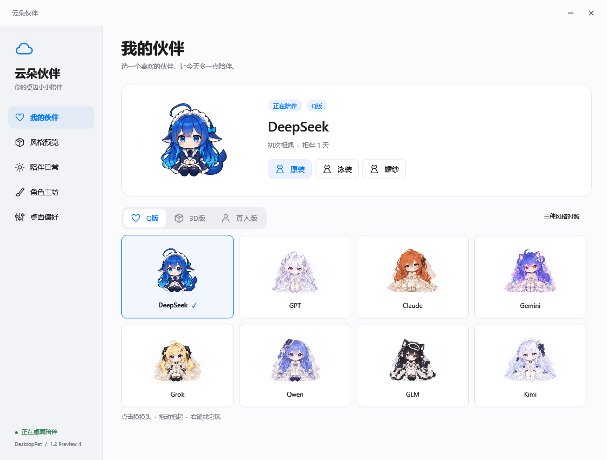
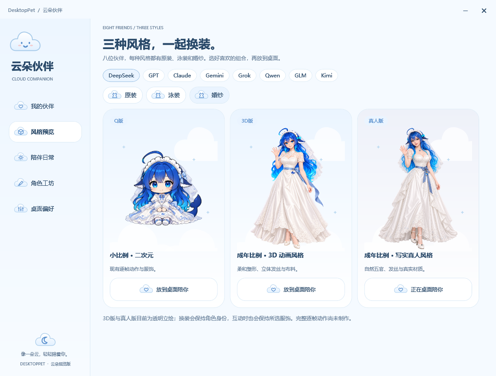
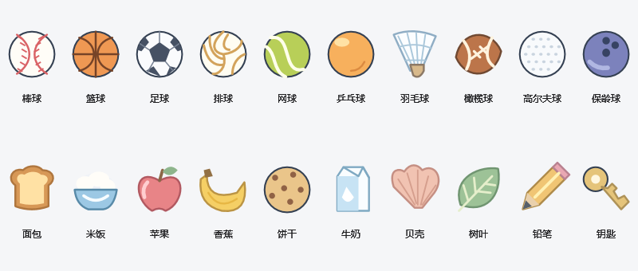

# DesktopPet · 云朵伙伴

一个真正待在 Windows 桌面上的小宠物。它会回应触摸、陪你玩球、散步找小礼物，也会安静地睡觉。无需登录或 API Key。



由 **QQ奶茶大神** 的 UsageDashboard_AI 与 Character_Generator 整合而来，互动和八位 AI 角色的 Q 版画稿来自 DS Go。沿用原生 WPF 透明窗口、托盘与快捷键；取消举看板、余额采集与平台登录。当前分支为 1.2.0-preview.10。

## 开始使用

下载 [最新绿色版](https://github.com/q438241zy/DesktopPet_AI/releases/latest)，完整解压后双击 `DesktopPet.exe`。保留旁边的 `Assets` 与 `Studio` 文件夹。绿色版包含 .NET 运行时，无须另装 SDK，不会设置开机启动。

- 点击睡着的宠物：打卡、叫醒并吃早饭。同一天只计算一次。
- 点击头、脸、身体：摸头、揉脸、挠痒。3D 与真人版按各自身体比例识别触摸位置。拖动使用稳定提起姿势，不再误触发甩动或晕眩。
- 右键宠物：展开浅色圆盘菜单，只有线形图标，悬停显示简短名称。照顾、玩耍、动作各有子圆盘；靠近屏幕边缘时向空处展开圆弧。再次右键或 Esc 收起，也可用 Shift+F10、Tab、方向键、Enter 操作。
- 躲猫猫：先沿桌边走到较近的一侧，再藏起、探头、走回。点击探出的宠物可以找到它；动作页也能指定左边或右边。
- 跳舞：仅八位真人版开放。程序控制肩、肘、躯干、髋、膝和脚踝，完成 16 拍轻舞；原装、泳装、婚纱使用各自当前纹理，长裙保持连贯。点击或空格跟拍会点亮节拍，无计分弹窗。Q版、3D版的菜单与日常页不显示跳舞。
- 玩球：随机拿出十种运动玩具之一，拖动后松开投出。碰到身体会做受惊动作，球向外弹开；没有碰到则做落空回应。推球已合并到玩球。捡到的球类也能从收藏架直接拿来玩。
- 搭积木：角色坐下拿起方块、放上塔顶，再松手展示。散步探索会带回永久保存的小礼物。
- 零食与早餐：食物送到嘴边，伴随咀嚼、碎屑和手臂动作；当天再次吃早餐仍会播放动作，但不会重复打卡。
- 发呆保持闭嘴仰望；跳跃有蹲下、腾空屈膝、缓冲落地；蜷起会坐下抱膝。休息先蜷起再侧躺，只有轻微呼吸；点击即可唤醒。
- 从底部工作列向上拖起：使用提起姿势；松手后停留在用户选定的位置，距底部 24 像素内会吸附。散步或躲藏需要回到地面时才自然落下；落下途中可重新抓起，不会瞬移或反复掉落。减少动态时直接返回地面。
- 照顾 → 聊天：直接在角色头顶输入及显示回复，没有额外聊天窗口。Enter 发送，Shift+Enter 换行。每次至少思考 1 秒；网络较慢时持续思考至返回。未设置 API 地址时使用本机预设多轮对话。API 地址、模型和金钥在「桌面偏好 → 角色聊天」设置；地址与模型保存，金钥只保留在本次进程。未配置时不会发送网络请求。
- 系统托盘双击：打开“云朵伙伴”。关闭设置窗口不会退出宠物。
- 设置采用奶油白、暖粉与杏桃色，配合柔软云朵、腮红笑脸 Logo、分段选择器与圆形开关。圆盘菜单继续使用线形图标，按钮改成小云朵。陪伴日常中的“结束互动”或 Esc 可取消当前互动；减少动态效果会停用舞蹈和边缘躲藏。

| 快捷键 | 操作 |
| --- | --- |
| Ctrl+Alt+U | 显示或隐藏 |
| Ctrl+Alt+S | 打开云朵伙伴 |
| Ctrl+Alt+L | 解除鼠标穿透并找回宠物 |
| Esc | 取消当前手势、菜单或玩具 |

## DeepSeek 长期动作 Demo

`tools/demo.ps1` 从当前桌面渲染器重新导出三种风格 × 三套服装的 DeepSeek 离线 HTML，并生成全部八位角色、72 套外观的动作清单。打开程序目录中的 `Demo/DeepSeek-demo.html`，保留同目录的 `frames` 文件夹；高清图片按当前动作载入。导出工具不会向桌面复制文件或创建捷径。

可以并排播放、暂停逐帧比较、换装、拖动放置、演示自然落下与头顶本机聊天。网页交互是独立展示逻辑，不能代替 Windows 鼠标或真实 API 验收。图像来自桌面渲染器，清单区分专用逐帧、专用姿势、程序动作、近似动作和缺少动作。

Preview 10 新增 56 张 Q 版动作图集、1,120 个姿势：原装补入揉脸、挠痒和等球；泳装与婚纱各有聊天、思考、摸头、揉脸、挠痒、敲打、跳跃、抱膝、侧躺、提起、等球、命中、落空、零食和早餐。进食各八帧，碗匙和手画在同一帧；其余动作按两到四个关键姿势播放，侧躺和提起保持最后姿势。原有十二帧行走和积木保留。清单继续根据角色包如实统计，不把静态姿势写成逐帧动画。生成与校准记录见 [Q 版动作连续性](artwork/chibi-continuity/prompts.md)。

Preview 9 的全部 72 套外观使用十二帧行走图，每帧 80 毫秒。脚步进度跟随实际位移，边缘转向前停稳 160 毫秒；头发、尾巴随整个人物统一转向。24 套 Q 版积木动画包含拿起、搬运、叠放及松手十二姿势。图片保留原始像素；Demo 使用 560×680 原尺寸、25 次/秒取样及无损 WebP。已有食物或槌子的图不再额外叠加同一道具，其余外观使用 Q 版画稿中的插画槌子。生成记录见 [动作修整](artwork/motion-polish/prompts.md)。

快捷键被其他程序占用时，系统托盘仍可操作。

## 八位伙伴、三种风格

Q版包含 GPT、Claude、Gemini、Grok、DeepSeek 鲸鱼娘、Qwen、GLM、Kimi。小埋已从角色目录、经典服装与运行素材中移除；旧存档曾选择小埋时，自动切换到 DeepSeek，保留打卡进度。

八位角色均提供 Q版、3D版、真人版，每种风格均有原装、泳装、婚纱，共 24 个角色条目、72 种外观组合。“我的伙伴”按画风选择角色并换装；“风格预览”按角色和服饰并排比较三种画风，再一键放到桌面。每个角色条目独立记住服装选择。

3D版为成年比例的风格化动画形象，真人版为成年比例的写实数字人。它们使用 48 张透明立绘，每套服饰另有独立十二帧行走动画。1.2.0-preview.6 的进食图继续负责面包拿起、入口、咀嚼和端碗、汤匙入口、回碗。1.2.0-preview.7 为全部 48 套外观补入十六姿势图集，共 768 个关键姿势：倾听、说话、发呆、起跳、腾空、落地、坐下抱膝、蜷紧、侧躺、拿积木、放积木、松手、提起、悬挂、被球碰到、球落空。坐卧按较低的身体高度显示，脚底或身体底部对齐地面。原装、泳装、婚纱各用自己的画稿，动作切换保持服装和画风。摸头、揉脸、挠痒及真人舞蹈仍使用程序骨骼。当前为二维图集与网格动画，不是实时 3D 模型。

新增图集和原始提示词见 [日常互动动作记录](artwork/interaction-poses/prompts.md)；上一版进食图的来源见 [进食动作记录](artwork/contact-motion/prompts.md)。

实际窗口画面：[端碗进食](docs/images/contact-meal.png)、[侧躺休息](docs/images/pose-rest.png)、[搭积木](docs/images/pose-blocks.png)、[文字聊天](docs/images/local-chat.png)。



新图使用内置 image_gen，沿用八位 Q 版角色的身份特征和已确认的 DeepSeek 两种画风；换装以各自原装立绘为参考。衣橱扩展阶段新增 46 张立绘，保留两张已确认的 DeepSeek 原装。完整提示词与素材位置见 [全角色衣橱记录](artwork/wardrobe-expansion/prompts.md)；最初网络风格参考见 [DeepSeek Demo 记录](artwork/style-demo/prompts.md)。

八位 Q 版角色有六姿势图集、独立坐姿晕眩图和多组原装动作，可选择原装、泳装、婚纱，各自记住服装选择。三套服饰均有独立行走、揉脸、挠痒、等球和积木动画；泳装与婚纱另有完整日常互动图集。动作只在当前服装内选择，不借用原装或其他画风。自定义包缺少专用画稿时仍显示同套服装的可用姿势；未列入当前验收清单的旧语义动作也可能使用语义回退。

行走朝向随移动方向翻转，可见脚底对齐桌面工作区，走到边缘后转身。以站立图或已有行走图校准人物尺寸，以头部位置稳定水平中心，避免新图留白不同造成的忽大忽小与跳动。移动速度按动作周期计算。1.2.0-preview.2 新增 56 张六帧行走图集：八张 Q 版泳装，以及 3D / 真人全部 48 套外观。生成记录见 [行走与服饰连续性](artwork/motion-continuity/prompts.md)。

1.2.0-preview.3 的躲藏流程使用当前服装的行走图集，并在原显示器工作区边缘裁切，避免露到相邻屏幕。取消、换装或换角色后恢复到屏幕内，存档不会留下屏幕外的位置。1.2.0-preview.4 将舞蹈改为真人版的二维骨骼网格动画，带手臂关节、交替抬脚和裙摆随动，使用当前服装立绘作为纹理；不切换到 Q 版，不播放背景音乐。它基于正面立绘做有限幅度的动作，不能代替完整三维模型的转身、遮挡和大幅舞蹈。

亲密度按累计打卡增长，有九级称号，中断不会扣减。保存领养日、纪念日、打卡记录及散步收藏；离开三天以上再次打开，会得到欢迎回来的回应。不设饥饿惩罚、疾病、清洁事务、麦克风或强迫照顾。

散步完成后从二十种物品混合抽签：棒球、篮球、足球、排球、网球、乒乓球、羽毛球、橄榄球、高尔夫球、保龄球，以及面包、米饭、苹果、香蕉、饼干、牛奶、贝壳、树叶、铅笔、钥匙。当前运行期间每轮打乱后逐个抽取，一轮内不重复；玩球有独立的十种玩具抽签池。收藏保存数量并兼容旧礼物名称，重启会重新洗牌。



## 角色工坊

原 Character_Generator 保留在 `skills/character-storyboard-generator`，完整保留 30 种姿势与 40 种表情的定义、出图规范及校验脚本。

应用内“角色工坊”可生成和复制出图提示词、导出 `pet.json` 模板，并导入图稿。**工坊本身不调用图片生成服务**：请将提示词与参考图交给支持出图的工具。

支持三种导入方式：

1. 含 `pet.json` 的完整角色包：可带六帧图集、各动作时间与服装。
2. 原生成器的标准 `__P01-…__E01-…` 命名 PNG 成果目录：将能识别的姿势映射为静态动作。
3. 单张 PNG、WebP、JPEG：作为静态宠物，支持拖动和互动入口。

单张图不会变成真实逐帧动画。完整规范见 [角色包格式](docs/character-packs.md)。

## 本地数据

存档和导入角色位于 `%LOCALAPPDATA%/DesktopPetAI/`。存档原子写入；损坏存档会保留带时间戳的副本。测试可通过 `--data-dir <独立目录>` 使用独立数据，避免改变日常存档。

程序不读取旧看板的 Cookie、账号令牌或 Codex 凭据。默认互动台词和聊天均在本机运行；只有填写聊天 API 后，发送的聊天内容才会提交到该地址。当前支持 Windows x64；macOS/Linux 没有在这一版移植。

## 开发与验证

需要 Windows 与 .NET 10 SDK。

```powershell
dotnet run --project src/DesktopPet.App
dotnet run --project tests/DesktopPet.Tests -c Release
./tools/check.ps1
./tools/publish.ps1
```

`check.ps1` 运行行为检查、WPF 构建、全部运行素材解码与真实窗口集成回归，使用隔离存档。`publish.ps1` 生成 `Release/win-x64/DesktopPet.exe` 及其素材目录。

```text
src/DesktopPet.Core/    角色与存档、动画选帧、圆盘布局、骨骼动作、物品抽签与玩具物理
src/DesktopPet.App/     WPF 桌面窗口、线形图标与设置、角色工坊
skills/                原角色生成器 Skill
artwork/sources/        用户指定目录的 16 张婚纱动作 PNG 原稿
artwork/style-demo/     DeepSeek 风格参考与生成提示词
artwork/wardrobe-expansion/  八位角色 3D / 真人版完整换装提示词与来源
artwork/motion-continuity/   三种画风的服装行走图集、提示词与来源记录
artwork/contact-motion/     48 套进食／接球图集的提示词、裁帧与手掌校准记录
artwork/interaction-poses/  48 套日常互动图集、提示词、裁帧与身高比例
artwork/chibi-continuity/   56 张 Q 版日常互动图集的提示词、来源与原像素校准
tests/                 独立行为检查
docs/                  角色包规范、迁移来源、测试记录
```

本项目独立运行，不修改 DS Go 的工程或用户数据。DS Go 的会话归档、模型完成通知和余额服务属于宿主功能，没有连接到本项目。

## 授权

沿用 [个人非商业许可](LICENSE)，保留 QQ奶茶大神署名。DS Go 移植部分的 MIT 许可、SkiaSharp 和美术来源见 [第三方说明](THIRD_PARTY_NOTICES.md)。角色同人形象不代表对应厂商官方吉祥物；第三方角色和商标的权利仍属于原权利方。
