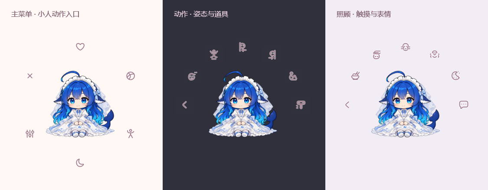

# 菜单图标含义调整

2026-09-28，重新绘制 14 个动作相关图标，保留透明圆盘、玫瑰灰线条、圆润端点、悬停反馈和简短提示。

| 项目 | 新图标 |
| --- | --- |
| 动作入口 | 舒展身体的小人 |
| 发呆 | 安静走神的脸，头侧少量思绪点 |
| 跳跃 | 举手、双脚离地的小人和地面线 |
| 蜷起 | 坐下抱膝的侧身姿态 |
| 轻敲 | 圆头小木槌和轻敲提示线 |
| 躲猫猫 | 从屏幕边缘探出的脸和扶边的小手 |
| 左侧／右侧躲藏 | 镜像的屏幕边缘、探头表情和对应方向箭头 |
| 摸头 | 手掌轻放在头顶，闭眼表情 |
| 揉脸 | 两侧手指揉脸颊 |
| 挠痒 | 笑脸和身体两侧的挠痒线 |
| 早餐／零食 | 饭碗与筷子／缺一口的饼干 |
| 跳舞 | 抬腿舞动的小人和小音符 |

共享 `ActionShapes` 供圆盘菜单和陪伴日常使用，早餐、零食和动作入口的映射已同步。动作键、菜单顺序和点击行为保持原样。

Release 构建零警告、零错误；现有 499 项互动回归检查全部通过，包含根菜单、照顾／玩耍／动作子菜单、屏幕边缘排布、提示名称和按钮调用。图标另按实际 25 px 与放大 48 px 检查，最终画面来自 WPF 渲染。验证使用 D 槽隔离存档。本轮没有修改宠物动作，长期动作 Demo 沿用原版。
