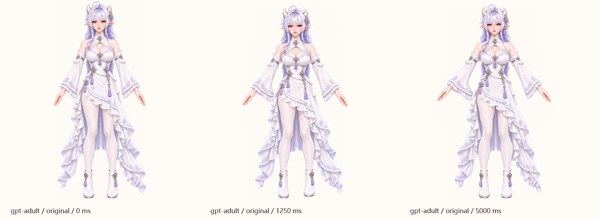

# Preview 13：真人舞蹈修正

2026-09-29。覆盖 GPT、Claude、Gemini、Grok、DeepSeek、Qwen、GLM、Kimi 的真人版，以及各自的原装、泳装、婚纱，共 24 套外观。

旧舞蹈直接使用交叉腿、挥手的待机立绘，并给所有服装套用近似关节。手臂附近的裙边和头发被同一组骨骼牵动，正面屈膝又被当成平面侧弯，所以会出现扭膝、滑脚和衣料拉尖。

## 美术与动作

- 用内置图像生成工具修订 8 张三服装图集，得到 24 个双脚分开、双臂自然放下的舞蹈底图。每套分别测量 17 个关节与裙摆轮廓，原图保持透明、按原像素保存。素材和完整提示词见 [制作记录](../artwork/dance-repair/prompts.md)。
- 参考 [Pittsburgh Ballet Theatre 的基础姿态](https://pbt.org/community/resources-audience-members/ballet-101/basic-ballet-positions/)和 [Royal Academy of Dance 的重心控制课程主题](https://www.royalacademyofdance.org/event/ballet-basics-posture-weight-placement-and-control/)，重新编排 16 拍轻侧步、点地、小幅展臂和收势。当前采用正面二维轻舞，动作幅度按立绘能表现的范围控制。
- 以透明轮廓约束骨骼权重，补充胸腹和裙摆的躯干控制范围。露肤手臂单独校准实心范围，宽袖保持柔和过渡；高低裙保留中央露腿区域。
- 双脚交替移动，另一只脚保持支撑；屈膝使用轻微的正面投影缩短。婚纱缩小步幅，长裙底部减少上下漂移。
- 动画由画面刷新推进，开始和结束以 220 ms 接回当前服装的待机姿势。舞蹈完整时长 8000 ms，原装、泳装、婚纱各用自己的素材。

## 验证

核心行为检查 39 项通过，Release 构建零警告、零错误。24 个角色的 1,368 项图片定义均可解码。舞蹈原生检查 10,996 项通过；既有互动 499 项、散步 4,329 项回归通过。所有检查使用 D 槽隔离存档，运行来源见 [验证摘要](../artwork/dance-repair/results/verification.json)。

舞蹈检查覆盖 24 套外观在 0–8000 ms 的 65 个时点：当前服装纹理、脚底不穿地、双腿不交叉、支撑脚接地、关节长度与相邻时点连续性、开始和结束回到准备姿势。另验证真实 WPF 画面回调推进，以及停止后解除回调。局部放大图用 560 像素角色高度核对手指、袖口和裙边；原生采样画面保存在 [results](../artwork/dance-repair/results/)。

本机画面回调的短时量测记录在 [dance-cadence.txt](../artwork/dance-repair/results/dance-cadence.txt)。这是 WPF 回调间隔的诊断数据；操作系统最终呈现、跨屏幕和实际鼠标操作仍需在桌面观察。

DeepSeek 常态 Demo 使用同一个桌面渲染器，真人舞蹈按 40 ms 导出完整 201 个时间点。网页可以暂停、逐帧和换装对照；页面入口继续为桌面的 `DeepSeek-動作Demo.lnk`，HTML 与素材位于 D 槽运行目录。

本次导出包含 9 套 DeepSeek 外观、228 段动作、5,055 张去重后的无损 WebP 画面和 1,872 条全角色动作清单。网页逻辑、完整舞蹈时长、逐帧数量、原始尺寸与离线素材路径检查通过。

## GPT 实测画面

[原装](../artwork/dance-repair/results/gpt-adult-original-detail.png) · [泳装](../artwork/dance-repair/results/gpt-adult-swim-detail.png) · [婚纱](../artwork/dance-repair/results/gpt-adult-wedding-detail.png)



复验命令：

```powershell
dotnet run --project tests/DesktopPet.Tests -c Release
dotnet build src/DesktopPet.App -c Release
# 运行 DesktopPet.exe，并为每次检查使用独立的 D 槽数据目录：
DesktopPet.exe --verify-dance --data-dir D:\VibeCoding\Character\artifacts\dance-check
DesktopPet.exe --verify-interactions --verify-walk --data-dir D:\VibeCoding\Character\artifacts\dance-regression
tools/demo.ps1
node tools/verify-demo.cjs <导出目录>\DeepSeek-demo.html
```
