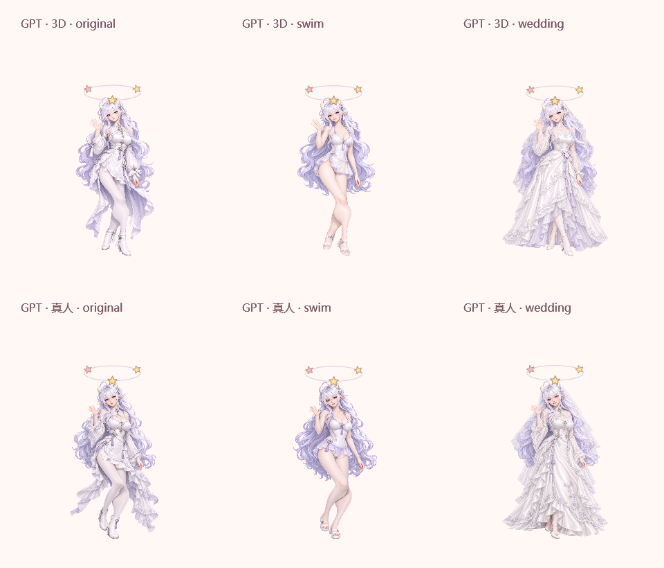

# Preview 11：摇晃头晕与桌面 Demo

2026-09-28，修复拖曳始终固定为提起、导致原有摇晃判定没有接入的问题。普通拖动仍使用当前服装的提起图；1.5 秒内至少四次明显转向才触发头顶环绕星星，支持水平或垂直方向。每段至少移动 40 逻辑像素，并过滤转向点的细微抖动、停顿和慢速调整；斜向移动不重复累计。持续摇晃延长效果，停止约 3 秒后恢复。

提着时身体保持提起，星星是独立反馈；松手时原地播放短暂晕眩。3D 和真人使用当前立绘的轻微程序动作，Q 版使用当前服装的晕眩姿势。不会变回原装或其他画风，不启动自然掉落；减少动态时保留静态星星。

本轮验证：

- Release 构建：零警告、零错误。
- 36 项核心行为检查，包括水平／垂直摇晃、幅度、速度、时间窗口、转向噪声、斜向计数及重置。
- 72 套外观共 1,200 项 WPF 摇晃与恢复检查：通过真正拖曳处理所调用的 `BeginLift / MoveLift / ReleaseLift` 执行，检查可见特效像素、环绕变化、保持服装、稳定提起、恢复时间、减少动态和取消。
- 352 项手动放置、自然落下与头顶聊天回归检查通过。
- Demo JavaScript 检查覆盖同一摇晃规则和恢复后保留位置，以及原有连续步态、转向、暂停与图片解码竞争。
- 独立发布版从 `D:\VibeCoding` 启动，再次通过全部 1,200 项摇晃检查；不依赖 C 槽旧桌面工程。
- 重新导出 9 套 DeepSeek 外观、228 段动作、4,641 张去重无损 WebP。560×680 原尺寸、25 次／秒取样、十二步态姿势、相对路径和全部图片文件检查通过；Demo 的真实 JavaScript 指针处理函数也通过普通拖动、摇晃、放开、捕获丢失和取消检查。

以上画面来自实际 WPF 渲染器，不是概念图。此会话没有可调用的 `node_repl`／computer-use 执行工具，因此没有做 Windows 系统级鼠标注入或跨屏拖曳验收；程序内的事件处理与渲染验证不能替代这一项。

动作清单新增「摇晃提起」与「头晕恢复」，共 24 个角色 × 3 套服装 × 26 项行为，即 1,872 行：1,120 项专用逐帧、192 项专用姿势、288 项程序动作、224 项静态姿势、48 项不适用，没有缺少或近似项。这只描述已列明的 26 项，不表示全部都是新绘逐帧美术。

用户明确要求保留桌面长期 Demo 入口，已记录于项目根目录 `AGENTS.md`。桌面 `DeepSeek-動作Demo.lnk` 指向 `D:\VibeCoding\Character\Release\win-x64\Demo\DeepSeek-demo.html`；HTML、frames、执行程序和工程留在 D 槽。`tools/desktop-demo.ps1` 可重复维护这一入口。这个约定取代此前「不创建桌面 Demo 捷径」的安排。
